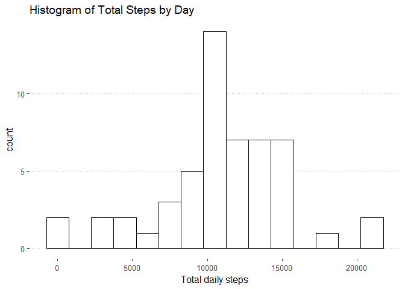
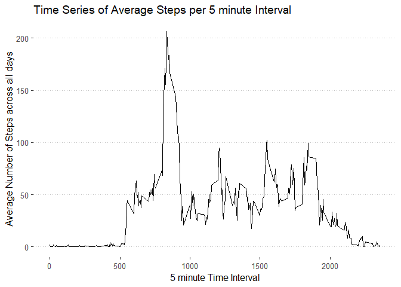
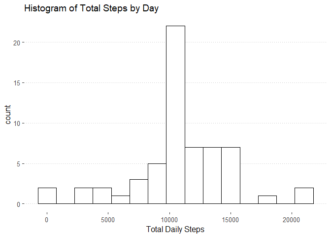
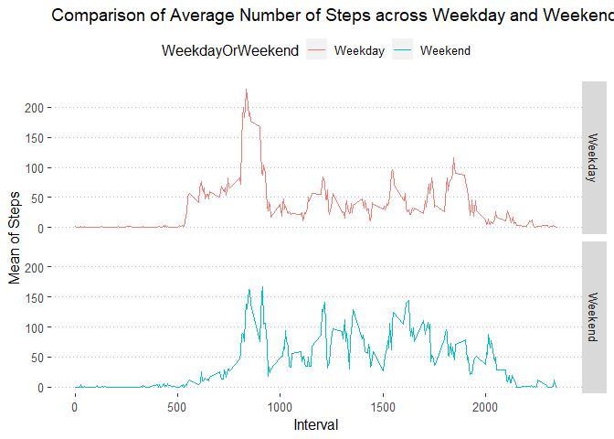

## Loading and preprocessing the data

```r
unzip('activity.zip')
stepdata <- read.csv('activity.csv', header = TRUE)
head(stepdata)
```

```
##   steps       date interval
## 1    NA 2012-10-01        0
## 2    NA 2012-10-01        5
## 3    NA 2012-10-01       10
## 4    NA 2012-10-01       15
## 5    NA 2012-10-01       20
## 6    NA 2012-10-01       25
```


## What is mean total number of steps taken per day?
Note that missing values are ignored for this part of the analysis

1. Calculating Total Number of Steps Taken per Day


```r
library(dplyr)
```

```
## 
## Attaching package: 'dplyr'
```

```
## The following objects are masked from 'package:stats':
## 
##     filter, lag
```

```
## The following objects are masked from 'package:base':
## 
##     intersect, setdiff, setequal, union
```

```r
stepdata2 <- stepdata %>% select(steps, date) %>% group_by(date) %>% summarise(totalsteps = sum(steps)) %>% na.omit()
```

```
## `summarise()` ungrouping output (override with `.groups` argument)
```

```r
head(stepdata2)
```

```
## # A tibble: 6 x 2
##   date       totalsteps
##   <chr>           <int>
## 1 2012-10-02        126
## 2 2012-10-03      11352
## 3 2012-10-04      12116
## 4 2012-10-05      13294
## 5 2012-10-06      15420
## 6 2012-10-07      11015
```

2. Histogram of Total Number of Steps Each Day


```r
library(ggplot2)
library(ggpubr)
hist1 <- ggplot(data = na.omit(stepdata2), aes(totalsteps))
hist1 + geom_histogram(binwidth = 1500, col = "black", fill = "white") + xlab("Total daily steps") + ggtitle("Histogram of Total Steps by Day") + theme_pubclean()
```

<!-- -->

3. Calcualte and report the mean and median of the total steps taken per day.


```r
mean(stepdata2$totalsteps, na.rm = TRUE)
```

```
## [1] 10766.19
```


```r
median(stepdata2$totalsteps, na.rm = TRUE)
```

```
## [1] 10765
```


## What is the average daily activity pattern?
1. Make a time series plot (i.e. type = "l") of the 5-minute interval (x-axis) and the average number of steps taken, averaged across all days (y-axis).


```r
stepdata3 <- stepdata %>% select(steps, interval) %>% group_by(interval) %>% na.omit() %>% summarise(av_steps = mean(steps))
```

```
## `summarise()` ungrouping output (override with `.groups` argument)
```

```r
TimeSeries1 <- ggplot(data = na.omit(stepdata3), aes(x = interval, y = av_steps))
TimeSeries1 + geom_line() + xlab("5 minute Time Interval") + ylab("Average Number of Steps across all days") + ggtitle("Time Series of Average Steps per 5 minute Interval") + theme_pubclean()
```

<!-- -->

2. Which 5-minute interval, on average across all the days in the dataset, contains the maximum number of steps?


```r
stepdata3[stepdata3$av_steps == max(stepdata3$av_steps), ]
```

```
## # A tibble: 1 x 2
##   interval av_steps
##      <int>    <dbl>
## 1      835     206.
```
Interval 835 contains the maximum number of steps, on average, across all days. 


## Imputing missing values
Note that there are a number of days/intervals where there are missing values (coded as NA). The presence of missing days may introduce bias into some calculations or summaries of the data.

1. Calculate and report the total number of missing values in the dataset (i.e. the total number of rows with NA)


```r
na_sum <- sum(is.na(stepdata$steps))
na_sum
```

```
## [1] 2304
```
There are 2304 missing values in the dataset

2. Devise a strategy for filling in all of the missing values in the dataset. The strategy does not need to be sophisticated. For example, you could use the mean/median for that day, or the mean for that 5-minute interval, etc.
I will use the mean of the corresponding 5 minute interval to replace the NAs in the dataset, then i will check to be sure the NAs are replaced. 


```r
replace_NA <- function(x) replace(x, is.na(x), mean(x, na.rm = TRUE))
stepdata4 <- stepdata %>% group_by(interval) %>% mutate(steps = replace_NA(steps))
sum(is.na(stepdata4$steps))
```

```
## [1] 0
```

```r
head(stepdata4)
```

```
## # A tibble: 6 x 3
## # Groups:   interval [6]
##    steps date       interval
##    <dbl> <chr>         <int>
## 1 1.72   2012-10-01        0
## 2 0.340  2012-10-01        5
## 3 0.132  2012-10-01       10
## 4 0.151  2012-10-01       15
## 5 0.0755 2012-10-01       20
## 6 2.09   2012-10-01       25
```

3. Create a new dataset that is equal to the original dataset but with the missing data filled in.


```r
new_stepdata <- as.data.frame(stepdata4)
head(new_stepdata)
```

```
##       steps       date interval
## 1 1.7169811 2012-10-01        0
## 2 0.3396226 2012-10-01        5
## 3 0.1320755 2012-10-01       10
## 4 0.1509434 2012-10-01       15
## 5 0.0754717 2012-10-01       20
## 6 2.0943396 2012-10-01       25
```


4. Make a histogram of the total number of steps taken each day and Calculate and report the mean and median total number of steps taken per day. Do these values differ from the estimates from the first part of the assignment? What is the impact of imputing missing data on the estimates of the total daily number of steps?


```r
new_stepdata2 <- new_stepdata %>% select(steps, date) %>% group_by(date) %>% summarise(total_steps = sum(steps))
```

```
## `summarise()` ungrouping output (override with `.groups` argument)
```

```r
hist2 <- ggplot(data = new_stepdata2, aes(x= total_steps))
hist2 + geom_histogram(binwidth = 1500, col = "black", fill = "white") + xlab("Total Daily Steps") + ggtitle("Histogram of Total Steps by Day") + theme_pubclean()
```

<!-- -->

```r
mean1 <- mean(new_stepdata2$total_steps)
mean1
```

```
## [1] 10766.19
```

```r
median1 <- median(new_stepdata2$total_steps)
median1
```

```
## [1] 10766.19
```

The mean total steps of the new dataset is 1.0766189\times 10^{4} 
the median total step of the new dataset is 1.0766189\times 10^{4}

The values of the mean of the old dataset with NAs and the new dataset with NAs replaced is the same. The median of the two datasets is slighlty different with the median of the new dataset slightly higher. The two histograms are similar in shape but the count of the highest bin is higher in the histogram of the new dataset.


## Are there differences in activity patterns between weekdays and weekends?
The dataset with NAs replaced is used for this part of the analysis

1. Create a new factor variable in the dataset with two levels – “weekday” and “weekend” indicating whether a given date is a weekday or weekend day.


```r
new_stepdata$date <- as.Date(new_stepdata$date)
new_stepdata$WeekdayOrWeekend <- ifelse(weekdays(new_stepdata$date) %in% c("Saturday", "Sunday"), "Weekend", "Weekday")
head(new_stepdata)
```

```
##       steps       date interval WeekdayOrWeekend
## 1 1.7169811 2012-10-01        0          Weekday
## 2 0.3396226 2012-10-01        5          Weekday
## 3 0.1320755 2012-10-01       10          Weekday
## 4 0.1509434 2012-10-01       15          Weekday
## 5 0.0754717 2012-10-01       20          Weekday
## 6 2.0943396 2012-10-01       25          Weekday
```

2. Make a panel plot containing a time series plot (i.e. type = "l") of the 5-minute interval (x-axis) and the average number of steps taken, averaged across all weekday days or weekend days (y-axis).


```r
new_stepdata3 <- new_stepdata %>% group_by(interval, WeekdayOrWeekend) %>% summarise(av_steps = mean(steps))
```

```
## `summarise()` regrouping output by 'interval' (override with `.groups` argument)
```

```r
ggplot(new_stepdata3, aes(x = interval, y = av_steps, col = WeekdayOrWeekend)) + geom_line() + facet_grid(WeekdayOrWeekend ~.) + xlab("Interval") + ylab("Mean of Steps") + ggtitle("Comparison of Average Number of Steps across Weekday and Weekend Per 5 Minute Interval") + theme_pubclean()
```

<!-- -->

There are differences in the activity patterns between weekdays and weekends. 

